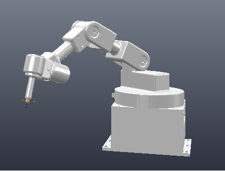
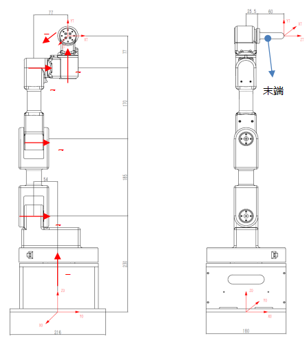

# 机械臂概况

# 机械臂DH参数

| 关节i | αi-1 | ai-1  | d      | θ       |
| ----- | ---- | ----- | ------ | ------- |
| 1     | 0    | 0     | 0.23   | θ1      |
| 2     | -90° | 0     | -0.054 | -90°+θ2 |
| 3     | 0    | 0.185 | 0      | θ3      |
| 4     | 0    | 0.17  | 0.077  | 90°+θ4  |
| 5     | 90°  | 0     | 0.077  | 90°+θ5  |
| 6     | 90°  | 0     | 0.0855 | θ6      |

# 正运动学计算

通过matlab得到初步输出，进一步化简得到：

t11 = -c6(c5s1 + c1c234s5) + c1s234s6

t12 = c5s1s6 + c1(c6s234 + c234s5s6)

t13 = c1c234c5 - s1s5

t14 = c1(0.0855c234c5 + 0.185s2 + 0.17s23 +0.077s234) +s1(-0.023-0.0855s5)

t21=c1c5c6+s1(-c234c6s5+s234s6)

t22=c6s1s234+(-c1c5+c234s1s5)s6

t23=c234c5s1+c1s5

t24=s1(0.0855c234c5+0.185s2+0.17s23+0.077s234)+c1(0.023+0.0855s5)

t31=c6s234s5+c234s6

t32=c234c6-s234s5s6

t33=-c5s234

t34=0.23+0.185c2+0.17c23+0.077c234-0.0855c5s234

t41 = t42 = t43 = 0 , t44 = 1 

# 逆运动学推导

T = T1T2T3T4T5T6变形得T1TT6 = T2T3T4T5

设$$ T = \begin{bmatrix} t11 & t12 & t13 & t14\\ t21 & t22 & t23 & t24 \\ t31 & t32 & t33 & t34 \\ t41 & t42 & t43 &t44\end{bmatrix} \tag{2}$$

左边等于

$$ \begin{bmatrix} t11c1c6-t12c1s6+t21c6s1-t22s1s6&-t13c1 - t23s1&t12c1c6 + t11c1s6 + t22c6s1 + t21s1s6&t14c1-0.0855t13c1 - 0.0855t23s1+t24s1\\t21c1c6-t11c6s1-t22c1s6+t12s1s6&t13s1 - t23c1&t22c1c6 - t12c6s1 + t21c1s6 - t11s1s6 & t24c1-0.0855t23c1 - 0.0855t13s1+t14s1\\t31c6-t32s6&-t33&t32c6+t31s6&t34-0.0855t33-0.23\\0&0&0&1\end{bmatrix} \tag{2} $$

右边等于

$$ \begin{bmatrix} -c234s5 & -c234c5 & s234 & 0.077s234 + 0.17s23 + 0.185s2\\ c5 & -s5 & 0 & 0.023 \\ s234s5 & s234c5 & c234 & 0.077c234 + 0.17c23 + 0.185c2 \\ 0&0&0&1\end{bmatrix} \tag{2} $$

$f_{ij}$对应i行j列的元素相等带来的等式。

由$f_{24}$，$ t1 = -atan2(0.023,\pm\sqrt{(t24-0.0855t23)^2+(t14-0.0855t13)^2-0.023^2})+atan2(t24-0.0855t23, t14-0.0855t13)$

 由$f23$,$t6 = atan2(t22c1-t12s1, -t21c1+t11s1)$  其中计算t1时根号取正号时$t6=t6-\pi$

再由$f22,t5=asin(t23c1-t13s1)$ 其中计算t1时根号取负号时$t5=-\pi-t5$

由$f12$,$c234 = \frac{t13c1+t23s1}{c5}$

由$f31$,$s234=\frac{t31c6-t32s6}{s5}$

令

$A=0.17,B=0.185\\C1=0.077s234-(t14c1-0.0855t13c1 - 0.0855t23s1+t24s1)\\C2=0.077c234-(t34-0.0855t33-0.23)$

则

$As23+Bs2+C1=0\\Ac23+Bc2+C2=0$

解得$$t2 = atan2(-C2,C1)-atan2(\frac{C1^2+C2^2-A^2+B^2}{2B},\pm\sqrt{C1^2+C2^2-\frac{C1^2+C2^2-A^2+B^2}{2B}^2})$$

$$t3 = atan2(-C2,C1)-atan2(\frac{C1^2+C2^2+A^2-B^2}{2A},\pm\sqrt{C1^2+C2^2-\frac{C1^2+C2^2+A^2-B^2}{2A}^2}) - t2$$ ，其中t2和t3的根号前不能同时取正号或同时取负号

$$t4 = atan2(s234,c234)-t2-t3$$

对比IK包中的IKSolver无误，详见代码。

-----以下废---------

移动常数项后两式平方相加得$t3 = \pm arccos(\frac{C1^2+C2^2-A^2-B^B}{2AB})$

$t2 = atan2((Ac3+B)C1-As3C2, -[As3C1 + (Ac3+B)C2])$

$t4 = atan2(s234, c234) - t2 - t3$